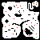

# Game Dev Field Guide - Team 4 Project

Project created for GDFG Team Jam 2025
Theme - Unknown

Team Members:

- klassy
- kanneblei
- nuzcraft
- elija
- soulkeeper
- tammerthehammer
- tyler frankenstein

Godot v 4.4.1

## How to Contribute

Check out this [Cheat Sheet](https://education.github.com/git-cheat-sheet-education.pdf) for git commands

1. install git on your machine
2. using the command line `git clone https://github.com/nuzcraft/gdfg-team-4.git` to get a copy of the code repository
3. `git pull` to _pull_ the most recent changes down from github to your machine
4. `git branch new-branch-name` to create a new branch to work from
5. `git add *` to add all new changes so they can be committed
6. `git commit -m "message"` to commit any added changes to to the branch
7. `git push` to push your changes up to github
   - if the branch does not exist on github yet, `git push --set-upstream origin new-branch-name` will do the trick
8. if changes are good to merge into the project, create a pull request in github to merge your branch into the `main` branch
   - the `main` branch is our good code
9. back on your machine, `git switch main` or `git checkout main` to switch back to the `main` branch
   - `git pull` to make sure you have the most recent changes, then repeat the cycle

## AOE Texturing (WIP)

- AOE Texture Replacer Scene handles rendering the AOEs and replacing the textures
- when ever we spawn an AOE, call add_sprite on the texture replacer and pass in your node
  - it will strip out the sprites and despawn timers
  - then hide the original aoe, it will still handle collisions, but we will render elsewhere
- sprites are added to canvas layer node in add mode (this will mix the colors)
- the canvas layer is invisible because it's in a subviewport
- we can get the image from the subviewport even if we can't see it
- a big white color rect covers the play area with the shader attached to it
- we pass in the subviewport texture, then replace primary and secondary colors with new textures
- _IMPORTANT_
  - only red and green supported right now
  - trivial to add new colors
  - still want to mask the walls from the tilemap so that the aoes stay under the walls
  - would like to add some wiggle

## PNG Level Generation

- create a small pixel image (50x50 probably at the largest)
- each pixel color represents what should be generated
  - white = floor
  - black = wall
  - blue = hero spawn point
  - green = crystals
  - red = enemy spawner
- name the files `level1.png` (replace with your number)
- in `level.gd` import the image file as a const and add it to the `level_images` dictionary
- if there is an image for a specific level, it will get generated instead of whatever level was manually placed there

below is the png used for the current level 2

## Credits

Some Placeholder Art by [Kenney](https://kenney.nl)
